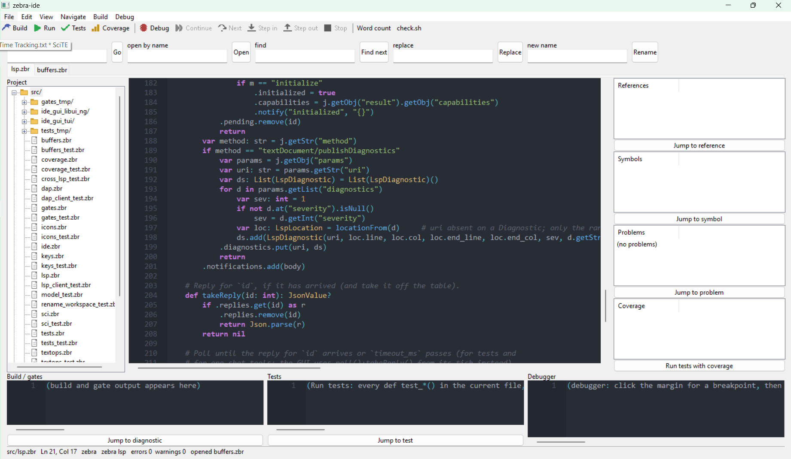

# zebra-ide

A lightweight IDE for Zebra, C and Zig, written in Zebra, on libui-ng + Scintilla,
talking to `zebra lsp` and `zebra debug`. Everything the IDE does beyond editing also
runs headless (`tools/check.sh`), so a window is never the only witness.

Status 2026-09-25: every headless gate passes (`tools/check.sh`, 17 steps). The IDE has
run with a window on Linux (GTK) and, on 2026-09-25, **opened and painted on Windows**:
menubar, toolbar, tab strip, project tree, colouring, the panes, and the status line
reporting `zebra lsp` connected -- checklist item 1 and the first half of item 2 below.
Everything interactive (typing, squiggles, keys, debugging, rename) has still not been
exercised on Windows; the checklist is written for that.

It needs Zebra **0.9.0-rc3 or newer** (rc1/rc2 lack the toolbar, hotkeys and tree it
uses). From a source build that means current `main`.



## Prerequisites (Windows laptop)

- `C:\Projects\zebra-language` built: `zig build` (Zig 0.16). Put `zig-out\bin` on
  PATH, or always start the IDE through `zebra` (which sets `ZEBRA_COMPILER` for it).
- For the debugger only: LLVM's `lldb-dap.exe` on PATH (`winget install LLVM.LLVM`,
  then add `<LLVM>\bin`). Without it the Debug button reports it and everything else
  still works.
- For gates: the manifest commands use `bash tools/*.sh` — run the IDE from Git Bash,
  or edit `zebra-ide.json` to whatever runs your scripts.
- For C and Zig language support: `clangd` (part of LLVM, same install as lldb-dap)
  and `zls` (a zls release matching the Zig version; `zls-x86_64-windows.zip`) on PATH.
  Optional — without them those languages get colouring only.

## Run

```
cd C:\Projects\zebra-ide
zebra --gui-backend=libui_ng src\ide.zbr -- src\lsp.zbr src\buffers.zbr
```

Files after `--` open as tabs. `zebra-ide.json` in the current directory is the
project (Build / Run gates read it); this repo has one, and so does zebra-language.

## First-run checklist (in this order — each step is a witness for the code beneath it)

1. **A window with two tabs** and syntax colouring → the hatch, tabs, styler and the
   compiler's libui section all link and run (`examples\tabs_sci_smoke.zbr` in
   zebra-language is the smaller version if the IDE itself will not open).
2. **Status line says `zebra lsp`** and, after typing a deliberate error, a red
   squiggle + margin marker + boxed message appear within ~a second → LSP round trip.
   Open a `.c` or `.zig` file: the status line adds `clangd` / `zls` (or says it is not on
   PATH) and the same squiggles work there.
3. **Type Enter after `def f()`** → the next line is indented, and **Ctrl+S saves**.
   If not, the notify/key bridge is not live. Since 2026-09-25 the compiler's pinned
   zig-libui-ng has it, so this should work with no setup; if you are developing
   zig-libui-ng itself, `set ZEBRA_LIBUI_PATH=C:\Projects\zig-libui-ng` builds against
   your local checkout instead. (Before that date the pin was stale, and a build WITHOUT
   that variable failed outright -- 14 compile errors -- rather than degrading.) Three
   key-bridge probes the refuter could not run without a window: hold
   Ctrl+S for two seconds — the buffer must gain no 0x13 bytes; with an IME active press
   F9 then commit a composition — the first committed character must not be lost; press
   F12 with an autocomplete/calltip open — its own keys must still work. Also close the
   middle of three tabs: the row must close up with no gap.
4. **Definition / References / Symbols / Rename** on `lsp.zbr` → panes fill; Jump
   works; rename across both open tabs.
5. **Build**, then **Run gates** → the pane fills, verdict lines appear, a failing gate's
   diagnostics are jumpable. (`zebra src\gates.zbr -- zebra-ide.json` is the same thing
   headless.)
5b. Open a file with `def test_*()` functions (`src\tests_tmp\suite.zbr` after `check.sh`
   has run, or write one: `assert 1 == 2` in a test) and press **Run tests** → the
   Tests pane lists every test with ✓ / ✗ and the failure message, the status line says
   `N/M passed`; put the caret on a ✗ line and **Jump to test** lands on the failing
   assert; **Re-run failed** runs only those (`zebra test --only …`). **Run** (Ctrl+R)
   runs the current file and shows its output in the gates pane.
5c. **Run tests with coverage** (Ctrl+Shift+C, or the button under the Coverage pane,
   2026-09-23) → the same run with `zebra test --coverage`; when it exits, the Coverage
   pane lists every file the run touched with `NN%  covered/statements  file` and a
   total, the status line says `coverage NN% (...)`, and the editor tints every
   statement line green (ran) or red (never ran) -- declaration lines, comments and
   blanks stay plain, because they are not statements. Double-click a Coverage row to
   open that file at its first uncovered line. Editing a buffer clears its colours (they
   would lie); **Clear coverage** in the Build menu drops the report. Witnessed on GTK:
   `coverage.zbr` at 97% with the one untaken arm red.
6. Put the caret on a line in a small program and press **Breakpoint** or F9 (the
   margin click and F9 need the bridge from step 3), then **Debug** or F5 → yellow
   arrow on that line, frames in the debugger pane; Next
   moves it; Stop ends it. Under the frames, Globals / Registers lists fill in a beat
   later (Locals says why it is empty). If `lldb-dap` is missing, the debugger pane
   shows the relay's own message saying so and how to install it.

If a step fails, the thing to send back is the status line text plus, for 2/4/6, the
child's stderr: run `zebra lsp` / `zebra debug file.zbr` by hand and paste what it
prints. Every layer below the window has a headless test that has been seen red; the
window itself has no automated test -- a person running it is the only witness.

## Project manifest (`zebra-ide.json`)

Build, Run gates and the tool buttons read `zebra-ide.json` from the directory you start
the IDE in; without one they say so in the status line. A starter for a one-file project
(`main.zbr` beside it):

```json
{
  "name": "hello",
  "build": { "cmd": ["zebra", "-c", "--check-full", "main.zbr"] },
  "gates": [
    { "name": "runs",  "cmd": ["zebra", "main.zbr"], "expect": "hello" },
    { "name": "tests", "cmd": ["zebra", "test", "main.zbr"] }
  ]
}
```

A gate passes when its command exits 0 and, if `expect` is given, its output contains
that text (`zebra test` already exits non-zero when a test fails, so the tests gate needs
no `expect`). Every field is optional. `cwd` (relative to the manifest), `timeout_ms`,
`skip` and the `tools` / `tests` sections are described under *Known limits* and in
`src/gates.zbr`; this repository's own `zebra-ide.json` is a larger example. Check one
headless with `zebra src\gates.zbr -- path\to\zebra-ide.json`.

The project tree hides whatever the project's `.gitignore` names (plus `.git`,
`zig-out`, `.zig-cache` and dotfiles), so build output and scratch directories stay out
of it.

## What is where

| file | what | test |
|---|---|---|
| `src/ide.zbr` | the program (MVU; model is a class; panes are read-only editors) | `model_test.zbr` (Model driven headless on tui), tui compile + libui sema in `check.sh` |
| `src/lsp.zbr` | LSP client (initialize, didOpen/Change, definition, references, rename, symbols); one instance per language server | `lsp_client_test.zbr`, `rename_workspace_test.zbr` vs real `zebra lsp`; `cross_lsp_test.zbr` vs clangd + zls |
| `src/dap.zbr` | DAP client over `zebra debug` (breakpoints, step, frames, scopes/variables) | `dap_client_test.zbr` vs real relay + lldb-dap |
| `src/transport.zbr` | Content-Length framing over `sys.spawnPiped`, shared by both | via the two above |
| `src/buffers.zbr` | open documents: paths, Scintilla document pointers, saved view state | `buffers_test.zbr` |
| `src/gates.zbr` | project manifest (gates + tools) + non-blocking runner + diagnostic parser; CLI | `gates_test.zbr`, `tools_test.zbr` |
| `src/tests.zbr` | the test runner as data: `zebra test --list` → suite, run output → ✓/✗/crash/not-run per test with jump lines, `--only` re-runs; pure | `tests_test.zbr` vs the real compiler; the Model path in `model_test.zbr` |
| `src/sci.zbr` | Scintilla message ids (generated: `tools/gen_sci.py`) | `sci_test.zbr` |
| `src/keys.zbr` | the shortcut table (chord → action), pure | `keys_test.zbr` |
| `src/ignore.zbr` | the project's `.gitignore` as the explorer's filter (glob, anchoring, dir-only, negation), pure | `ignore_test.zbr` |
| `src/textops.zbr` | WorkspaceEdit application (in memory, and `applyWorkspaceEditToDisk` for unopened files), symbol outline, auto-indent decision | `textops_test.zbr`, `rename_workspace_test.zbr` |
| `tools/check.sh` | the gate: all of the above, 17 steps | — |

## Known limits (stated, not hidden)

- Tabs are a real `uiTab` strip (since 09-16), one page per open file over the one
  Scintilla editor; selecting a tab drives the model and back.
- Keyboard shortcuts (live since the 2026-09-25 pin bump): Ctrl+S
  save, Ctrl+W close, Ctrl+F find next, Ctrl+B build, Ctrl+Shift+B gates, Ctrl+R run
  the current file, Ctrl+Shift+T run its tests, Ctrl+Shift+R re-run the failed ones,
  Ctrl+Shift+C run them with coverage,
  Ctrl+G go to the line typed in the `line` box,
  F5 debug / continue, Shift+F5 stop, F9 breakpoint, F10 next, F11 step in, Shift+F11
  step out, F12 definition, Shift+F12 references. The table is `src/keys.zbr` (keys_test checks
  it claims nothing Scintilla owns — Ctrl+C/V/X/Z/Y/A stay the editor's).
- Variables: when the program stops, the debugger pane shows the top frame's scopes
  under the frames — Globals and Registers with values (first 40 each), and Locals,
  which is EMPTY for Zig programs because lldb has no Zig language plugin; the pane
  says so rather than showing a blank. (09-08; dap_client_test checks the scopes.)
- The tui backend only proves the program compiles; its editor is a text stub.
- Squiggles on `selfhost/CodeGen.zbr` lag by the compiler's own check time (~6 s).
- C and Zig have language servers now (09-08): a C buffer goes to `clangd`, a Zig
  buffer to `zls`, each started the first time such a file opens and each getting
  only its own language's files. Diagnostics, Definition, References, Symbols and
  Rename work through the same client as `zebra lsp` (cross_lsp_test proves all four
  on both). If `clangd` / `zls` is not on PATH the status line says so once and that
  language keeps colouring only. zls wants `zig` on PATH; clangd uses default flags
  unless a `compile_commands.json` is beside the file.
- **Plugins, kind 1 — process tools (09-08):** `"tools": [...]` in `zebra-ide.json`;
  each is a command with `${file}` `${dir}` `${root}` `${stem}` `${line}` `${col}`
  `${word}` substituted, run through the gate runner (never blocks), output in the
  gate pane. `"reload": true` re-reads the file after exit 0 (formatters), `"diags":
  true` marks `path:line:col: error:` lines in the editor, `"on": "save" | "open"`
  makes it a hook instead of a button. A dirty buffer is saved before a tool that
  names `${file}`. Design: wiki `concept_zebra-ide-plugins`. Kind 2 (in-process
  DLLs) waits on the compiler's shared-library round trip (BUG-356, pinned gate).
- **Haiku: dropped.** zig-libui-ng removed its Haiku backend on 2026-09-23; the IDE's
  platforms are Windows and Linux (GTK), with macOS written but untested.
- Rename edits open buffers in memory (unsaved) and rewrites unopened files on disk
  in place, and says so in the status line. Close refuses once on unsaved changes.
  `zebra lsp` (from 09-08) resolves the `use` graph from disk — the modules a file
  uses, and the same-directory files that use it — so a rename or Definition reaches
  modules that are not open. Dependents are found one directory deep, not recursively.
  (rename_workspace_test, 09-08 — the on-disk path had never run before it; its first
  run found two compiler bugs, BUG-352/353, and the open-documents-only server.)
- A gate that cannot run here (no lldb-dap) reports **SKIP**, not PASS — in the pane,
  in `gates.zbr`, and in `check.sh`.
- **Problems / Go to line / Open by name (09-09):** the Problems pane under Symbols lists
  the current file's diagnostics (`E 12:5 message`, errors first) whenever the squiggles
  are redrawn — LSP, build or tool — and **Jump to problem** goes there. `line` + **Go**
  (Ctrl+G) jumps to a line number; `open by name` + **Open** opens the first file under
  the project root whose name matches (exact base name, then path suffix, then contains;
  .git / zig-out / .zig-cache skipped). No project-wide test runner on purpose: a test
  file registered as a gate (`"cmd": ["zebra", "test", "x_test.zbr"]`) already is one,
  and Run gates runs them all.
- **Tests (09-09):** Run tests / Re-run failed / Jump to test, on the current file.
  Discovery is the compiler's (`zebra test --list`: `def test_*()` with no params, and
  class-static `test_*`; a `def test_x(n)` is not a test and is not listed), the run is
  `zebra test [--only …]`, both queued through the gate runner so they never overlap a
  build. Per test: ✓ pass, ✗ fail with the message -- a failing `assert` in a test is a
  FAIL verdict naming both operands (`left: 1, right: 2`) and the run continues to the
  next test -- and ✗! crash for a real panic, where the process ends and everything after
  it is "not run"; the compiler's `RUN:` line pins it on the right test and `assert
  failed at f.zbr:NN` gives the jump line. (`assert_eq` / `assert_true` are not Zebra
  any more: write `assert a == b`.) `"tests": { "on_save": true }` in the manifest runs the saved
  file's tests on every Ctrl+S. Only `.zbr` files; a file with no tests says so.
